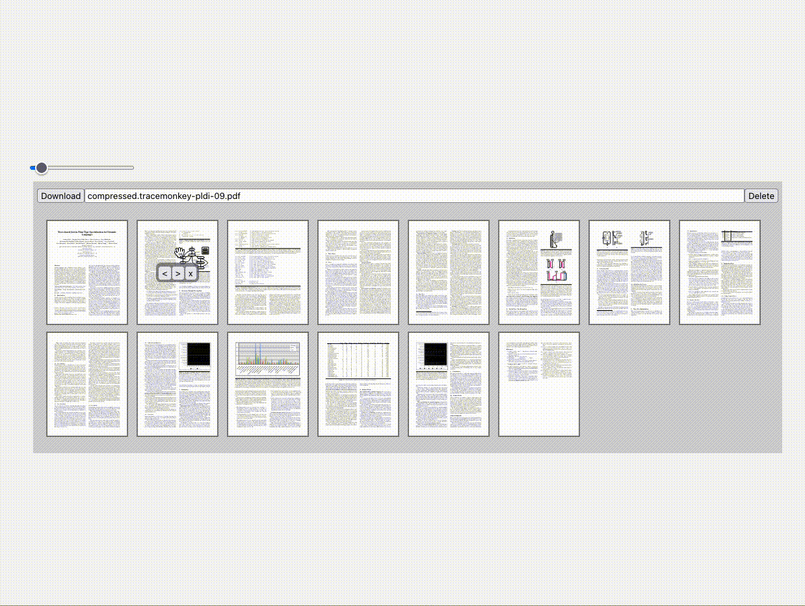

# pdf-test

Building a PDF page splitter using [vue-pdf](https://github.com/TaTo30/vue-pdf) and [vueUse](https://github.com/vueuse/vueuse).



## Project Setup

```sh
pnpm install
```

### Compile and Hot-Reload for Development

```sh
pnpm run dev
```

### Compile and Minify for Production

```sh
pnpm run build
```
